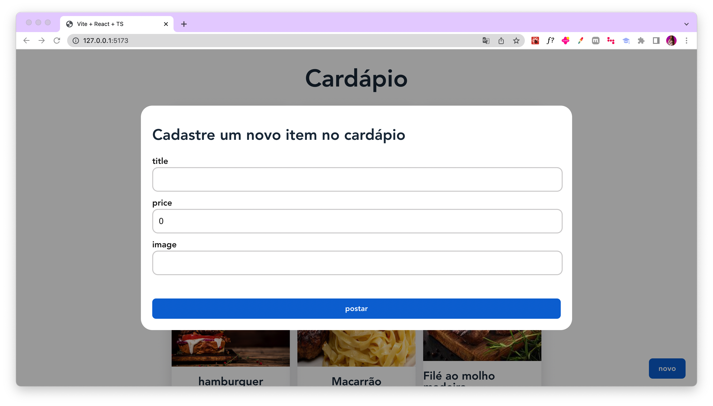

# Cardápio Digital - Aplicação Frontend

Este projeto é um protótipo de um Cardápio Digital. A aplicação foi desenvolvida usando **React, Typescript e React Query**.

<h1 align="center">
    
    
</h1>

## 💻 Requisitos

Antes de iniciar, você deve ter o Node.js e o NPM instalados em sua máquina.

## 🚀 Instalando

Primeiro, você deve clonar o projeto na sua máquina, para isso você
pode colar o seguinte comando em seu terminal

Para instalar as dependências, execute o seguinte comando:

```bash
npm install
```

Por fim, para executar o projeto basta rodar o seguinte:

```bash
npm run dev
```

## 🔧 Compilação

Para compilar a aplicação para produção, execute o seguinte comando:

```bash
npm run build
```
Isso irá gerar uma versão otimizada da aplicação na pasta `dist`.

## 🫂 Integração com Backend

Para realizar a integração com o Backend, você pode clonar o projeto e rodar localmente, ou desenvolver você mesmo.

## Minhas Redes

Meu Linkedin: [elisandro-soares](https://www.linkedin.com/in/elisandro-soares/); 

Github: [@Zandro007](https://github.com/Zandro007) &nbsp;&middot;&nbsp;

X:  [@Zandro007](https://twitter.com/zandro007) &nbsp;&middot;&nbsp;


## 📝 Licença

Este projeto está licenciado sob a licença MIT. Consulte o arquivo `LICENSE` para obter mais informações.
